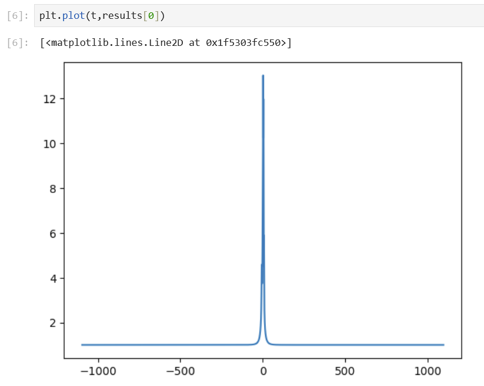

# Issues with TripleAstroLightCurve #27

> Closed as not planned

---

@GregCuautle
Description
GregCuautle
opened on Jun 27

```
    #Hi! I'm trying to use the TripleAstroLightCurve function from VBMicrolensing, but every time I run it, it crashes my kernel without throwing a Python error. I’m wondering if there might be a mistake in how I’m formatting or passing the parameters. Here's a minimal version of my setup:

    import numpy as np
    import VBMicrolensing
    import matplotlib.pyplot as plt

    # Initialize VBMicrolensing instance
    VBM = VBMicrolensing.VBMicrolensing()
    VBM.RelTol = 1e-3
    VBM.Tol = 1e-3
    VBM.astrometry = True

    # System parameters
    s12 = 0.9
    q2 = 0.028997
    u0 = 0.1
    alpha = 0.261799  # radians
    rho = 0.01
    tE = 20
    t0 = 0
    s23 = 1.5
    q3 = 0.003270
    psi = 0.785398  # radians

    # Astrometric parameters
    piEN = 0.1
    piEE = 0.1
    muS_N = 0.1
    muS_E = 0.1
    piS = 0.1
    thetaE = 1.0

    # Time array
    num_points = 10
    tmin = -50
    tmax = 50
    t = np.linspace(t0 + tmin, t0 + tmax, num_points).tolist()

    # Parameter list
    params = [
        np.log(s12), np.log(q2), u0, alpha, np.log(rho), np.log(tE), t0,
        np.log(s23), np.log(q3), psi,
        piEN, piEE, muS_N, muS_E, piS, thetaE
    ]

    # The crash occurs when I call this next line:
    result = VBM.TripleAstroLightCurve(params, t)
```

---

Activity
valboz
valboz commented on Jun 27
valboz
on Jun 27
Owner

    Thanks for trying Astrometry with triple lenses. It seems you are missing a call to SetObjectCoordinates. Without coordinates, parallax calculations are not possible (see CentroidTrajectories.md). Can you check?


---

GregCuautle
closed this as not plannedon Jul 8
GregCuautle
GregCuautle commented on Jul 8
GregCuautle
on Jul 8
Author
```
    #Sorry, did not mean to close the issue.
    #The problem persists even after calling SetObjectCoordinates. This is my setup now:

    import numpy as np
    import VBMicrolensing
    import matplotlib.pyplot as plt
    import math

    # Initialize VBMicrolensing() class object
    VBM = VBMicrolensing.VBMicrolensing()
    #Set relative accuracy
    VBM.RelTol = 1e-03
    #Set accuracy
    VBM.Tol=1e-03

    VBM.astrometry = True

    VBM.SetObjectCoordinates("17:51:40.2082 -29:53:26.502"); 

    # Parameters
    s12 = 0.9
    q2 = 0.028997
    u0 = 0.1
    alpha = 0.261799
    rho = 0.01
    tE = 20
    t0 = 0
    s23 = 1.5
    q3 = 0.003270
    psi = 0.785398

    # Astrometry
    paiN = 0.1
    paiE = 0.1
    muS_N = -3
    muS_E = -2
    pai_S = 0.12
    thetaE = 5.15

    # Parameter list
    params = [
        math.log(s12), math.log(q2), u0, alpha, math.log(rho), math.log(tE), t0,
        math.log(s23), math.log(q3), psi,
        paiN, paiE, muS_N, muS_E, pai_S, thetaE
    ]

    # Time
    t = np.linspace(-3*365.25+t0,3*365.25+t0,10000)

    #It crashes on this line:
    results = VBM.TripleAstroLightCurve(params, t)
```

---

valboz
valboz commented on Jul 8
valboz
on Jul 8
Owner

    Strange!
    I copied your code and it did not crash. It took 3 seconds to complete and then here is the plot
    

    
    Which operating system are you working on?

---
